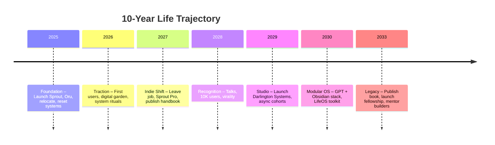

> A decade forecast from first principles. Synthesizing career trajectory, values alignment, behavior change systems, and modular tooling. This is a living map—subject to adaptation.

---

## Core Trajectory

From 2025 to 2035, I transition from:
- **Engineer with vision** → **Toolmaker with traction** → **Systems architect with impact**
- Building solo tools → Operating a product studio → Designing humane infrastructure for focus, health, and fulfillment

---

## Key Life Themes

- **Alignment over achievement** — less hustle, more congruence
- **Modular systems over hacks** — rituals and agents, not dopamine tricks
- **Flow-first design** — tools that help me and others enter deep focus
- **Obsidian + VS Code as basecamp** — all life systems orbit here

---

## Forecast by Year

### 2025 — Refinement & Foundation

**Context:**
- On paid leave, recalibrating post-layoff
- Launching: Oru, Sprout, Interview Analyzer
- Deep introspection: diet, identity, values

**Milestones:**
- Ship MVP of Sprout + Oru
- Begin regular digital gardening (Quartz / darlington.dev)
- Relocate to Portugal or return to SE Asia
- Land remote role at a mission-aligned startup

**Systems Activated:**
- Observer agent MVP
- Modular Obsidian templates (weekly review, rituals)
- iOS Shortcuts + Supabase backend for Oru logging

---

### 2026 — Traction & Duality

**Theme:** Day job vs mission

**Milestones:**
- Sprout + Oru gain early traction from indie devs
- First paid users or toolkit sales
- Start cohort-based experiments (e.g. “30-Day Flow Sprint”)
- Publish content on system design, automation, and behavior

**Growth Edge:**  
- Clarify product/mission identity
- Tighter community curation
- Solidify rituals that scale

---

### 2027 — Integration Year

**Theme:** All-in on alignment

**Milestones:**
- Exit job to go indie OR create a dual-mode lifestyle (90% async)
- Launch Sprout Pro (VS Code extension, visual overlays)
- Publish first full framework: *Digital Ritualist Handbook*
- Hire 1st collaborator (frontend, designer, or GPT engineer)

---

### 2028 — Recognition

**Theme:** The world starts watching

**Milestones:**
- Speak at a developer or productivity-focused event
- Frameworks become memes (Sprout plant, Observer agent, etc.)
- 10k+ users
- Partner with other builders or wellness startups

**Meta:**  
The project evolves from tools → philosophy.

---

### 2029 — Product Studio Era

**Milestones:**
- Launch “Darlington Systems” or “Modular Being”
- Cohort-based offerings + async curriculum + consulting
- Begin investing back into OSS: agent tools, rituals API
- Establish clear GTM channel (e.g. content + community)

**Focus:**  
- Less execution, more mentoring
- Delegation and design systems
- Remote culture around deep work

---

### 2030–2032 — Life OS Stack

**Milestones:**
- AI-augmented Obsidian + GPT system running 100%
- Full release of Modular Life Agents (Observer, Pathfinder, Ritualist, Connector)
- Book in progress: *Tending the Digital Garden*
- Launch public vault + open toolkit library

**Behavioral Infrastructure:**
- GPT + Shortcuts automation for habits
- Deep tracking of flow, energy, values alignment
- Cross-device rituals

---

### 2033–2035 — Legacy Mode

**Milestones:**
- Publish first book + expand community
- Launch digital fellowship: Systems Design for Personal Transformation
- Mentor next-gen indie toolmakers
- Personal mission transitions into collective design

**Long-term Vision:**
> A modular, privacy-first stack of tools and rituals to help anyone live better—with clear metaphors, open protocols, and humane defaults.

---

## Constants (Agents Running)

- **Observer Agent** → Weekly reflection, energy tracking, value alignment
- **Pathfinder Agent** → Mission tracking, long-term goal progress
- **Ritualist Agent** → Daily routines, stretch/hydration/popups, habit nudges
- **Connector Agent** → Maintains social graph, connection loops, serendipity triggers

---

## Living Framework

This document is a live object—revisit each quarter via the Observer Agent during your Weekly Review. Re-align forecast with current data.

- [ ] Add this to your [[Weekly Review System]]
- [ ] Create MOC: `10-Year Plan` linking out to major sub-systems
- [x] Visualize this as a roadmap using Mermaid or Notion-style board

