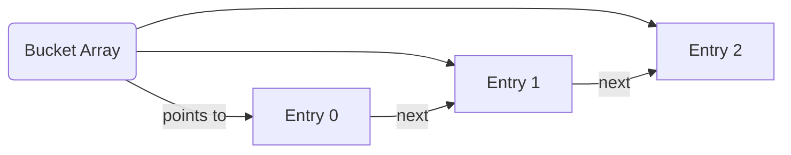
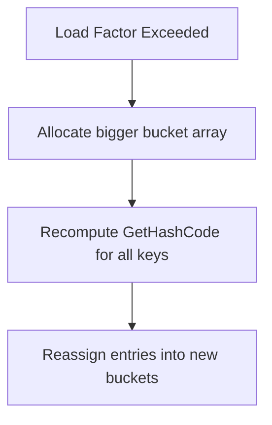

# Deep Dive into .NET Dictionaries

This document summarizes the complete internal mechanics of how `Dictionary<TKey, TValue>` works in .NET, with special attention to hashing, equality, memory layout, performance considerations, and collision handling.

---

## 1. What is a .NET Dictionary?

A `Dictionary<TKey, TValue>` is an **optimized hash-based key-value store** that:

- Provides near O(1) lookup, insert, and delete operations.
- Internally uses **arrays of buckets** and **entries**.

It is one of the fundamental data structures underpinning performant applications.

---

## 2. Internal Structure

At a high level:

- **Buckets (`int[]`)**: An array where each slot points to the index of the first entry in that bucket.
- **Entries (`Entry<TKey, TValue>[]`)**: An array of structs that store:
  - `hashCode`: Cached hashcode of the key.
  - `next`: Index of the next entry in the collision chain.
  - `key`: Actual key.
  - `value`: Actual value.

```csharp
struct Entry<TKey, TValue> {
    int hashCode;
    int next;
    TKey key;
    TValue value;
}
```

✅ Both arrays are allocated on the **Heap**.

### Diagram: Bucket and Entry Structure



---

## 3. How Operations Work

### Insert

```csharp
int hash = key.GetHashCode();
int bucketIndex = hash % buckets.Length;
// Insert Entry and update buckets
```

### Lookup

```csharp
int hash = key.GetHashCode();
int bucketIndex = hash % buckets.Length;
for (int i = buckets[bucketIndex]; i >= 0; i = entries[i].next) {
    if (entries[i].hashCode == hash && entries[i].key.Equals(key)) {
        return entries[i].value;
    }
}
```

---

## 4. Hashing (GetHashCode)

Hashing reduces object data to a fast, small integer.

- `.GetHashCode()` is computed at runtime.
- It spreads keys across buckets for even distribution.

Simple string hash example:

```csharp
public override int GetHashCode() {
    int hash = 17;
    hash = hash * 23 + (Name?.GetHashCode() ?? 0);
    hash = hash * 23 + Age.GetHashCode();
    return hash;
}
```

✅ Rolling math operations only — CPU-fast.

---

## 5. Equality (Equals)

Equality checks if two keys are logically identical.

### Default Behavior

- Compares reference by default (reference identity).

### Custom Behavior with IEquatable

```csharp
public class Person : IEquatable<Person> {
    public string Name;

    public bool Equals(Person other) {
        return this.Name == other.Name;
    }

    public override bool Equals(object obj) => Equals(obj as Person);
    public override int GetHashCode() => Name.GetHashCode();
}
```

✅ Type-safe, avoids boxing.

---

## 6. Collision Chains

When multiple keys hash into the same bucket, entries are chained.

### Diagram: Collision Chain

```mermaid
graph TD
  A(Bucket 2) --> B[Entry 0: apple]
  B --> C[Entry 1: banana]
  C --> D[Entry 2: cherry]
  D --> E[-1 (end of chain)]
```

✅ Traversal follows `next` pointers.

---

## 7. Memory and Performance

- **Heap Allocation**: Buckets and entries live in managed heap memory.
- **Load Factor (~0.72)**: Triggers resize and rehash.
- **Resizing**: Expensive, involves rehashing all entries.

### Diagram: Resizing Flow



✅ Dictionary dynamically grows using primes to minimize collisions.

---

## 8. Common Pitfalls

- Forgetting to override `GetHashCode()` with `Equals()`.
- Mutating a key after inserting it.
- Poor hash function causing many collisions.
- Relying on reference equality for logical equality.

✅ Always implement `IEquatable<T>` and consistent `Equals`/`GetHashCode`.

---

## 9. Important Distinctions

| Concept         | Purpose                            |
| --------------- | ---------------------------------- |
| Hashing         | Fast bucket narrowing              |
| Equality        | Confirm exact key                  |
| Collision Chain | Handle multiple keys in one bucket |
| Reference in C  | Raw pointer                        |
| Reference in C# | GC-managed opaque handle           |

---

## 10. Anything We Missed

- .NET Core added randomized hashing to make attacks harder.
- `GetHashCode` output stability: Stable within process, not across runs.
- Different probing strategies in other languages: .NET uses chaining.
- Boxing performance hit without IEquatable for structs.

✅ Dictionary is both fast and secure when used properly.

---

# 🚀 Final Mental Model

> **Hash to narrow the field, Equals to confirm the match, Entries to store the data, and Collision Chains to handle the mess.**

✅ If you understand this, you understand Dictionaries like a real systems engineer.

---

# Related Tags

- Hashing
- Data Structures
- .NET Internals
- Systems Programming
- High-Performance C#
